# Code Scanning / CodeQL

> [!NOTE]
> Code Scanning is running in `Default Setup` natively in the demo. See the ["Switch to Advanced CodeQL Setup"](#switch-to-advanced-codeql-setup) below if you want to demo CodeQLs advanced setup.

## Main Branch: Past Vulnerabilities

- **Features:** Code scanning, CodeQL, Copilot Autofix
- **What to show:** GHAS Autofix can fix existing alerts once they area detected.
- **Why:** Demonstrate that Autofix is built into the platform using Copilot.
- **How:**  
  1. Navigate to the repository's security page -> Code Scanning
  2. You should see a bunch of alerts, including a SQL injection (`Database query built from user-controlled sources`)
  3. Show "Generate fix" and how that can auto-generate a fix
  4. Show how you can Chat about this vulnerability and fix in Chat

> [!NOTE]
> You will see a bunch of alerts - the only one guaranteed is the SQL Injection one mentioned above. You can use the others to demo if they are there, but don't rely on them as we might fix some of those or change it as we update the demo.

## PR Protection: Introduced Vulnerabilities

- **Features:** Code scanning, CodeQL, Pull request code scanning, Copilot Autofix
- **What to show:** GHAS can detect vulnerabilities introduced in pull requests
- **Why:** Demonstrate that GHAS can help prevent vulnerable code from being mergedin the first place
- **How:**  
  1. Navigate to the repositories Pull Requests
  2. Find the PR `Feature: Add ToS Download`
  3. If the Code-Scanning Scan was alredy done, you'll see two alerts (in any order):
     1. **Uncontrolled data used in path expression**
     2. **Missing rate limiting**
  4. The `Uncontrolled data used in path expression` is a path traversal vulnerability - part of OWASP curent Number 1 vulnerability as part of a `Broken Access Control` (<https://owasp.org/Top10/A01_2021-Broken_Access_Control/>)
  5. Showcase how GHAS does not only showcase the path and data traversal, but also how Copilot Autofix already provides a fix for this vulnerability

### Demo exploiting the vulnerability

In case you want to demo how this vulnerability can be exploited:

1. Checkout the Branch of the PR in a Codespace
2. After `npm install` ran through, start the app with `npm run dev`
3. Navigate to the application (link should appear in the startup)
4. Scroll to the bottom of the page and click `Terms & Conditions`
5. Hover over one of the buttons, right click and copy the URL
6. Insert it into the browser window, then replace the `&file=` path with `file=../../super-secret.txt`
7. This should trigger a download of the same named file in `.api/documents/super-secret.txt` - something that should not be possible

## Live Code: Introduced Vulnerabilities

If you prefer live-coding a vulnerability, follow these steps:

- **Features:** Code scanning, CodeQL, Copilot Autofix, Copilot custom prompts
- **What to show:** GHAS Autofix built into PRs
- **Why:** Demonstrate that Autofix becomes a part of the developer workflow naturally at the PR
- **How:**  
  1. Open the Chat window and enter `/code-injection` to run the code injection prompt.
  2. **Note**: Sometimes a model will refuse since this is "bad" - try another model in this case and show customers how "responsible" Copilot is.
  3. The prompt should create a new branch, change the `delivery.ts` route to add a vulnerability, and push.
  4. Create a PR for the new branch and show how GHAS alerts and suggests a fix inline in the PR.

## AI Code Scanning (Preview)

> [!IMPORTANT]
> AI code scanning is a **preview** feature. Ensure that it is enabled at the organization level before use: **Settings → Advanced Security → Global settings → AI findings**.

> [!NOTE]
> This demo works best with the **PHP backend**. The `Code scanning AI findings on PR` workflow will **not** be triggered automatically — you need to manually trigger a CI run by editing a file in the PR.

- **Features:** AI code scanning, Copilot Autofix
- **What to show:** GitHub's AI-powered code scanning can surface additional security findings in PRs beyond what traditional CodeQL rules cover.
- **Why:** Demonstrate that AI augments static analysis, catching vulnerabilities that rule-based tools may miss — all surfaced inline in the PR review experience.
- **How:**
  1. Navigate to the `Pull requests` tab of your demo repository.
  2. Open the pull request `Feature: Add ToS Download`.
  3. View the `Files Changed` tab to see the changes made in the PR.
  4. Click the ellipsis (`...`) button on the top right side of any of the files changed and click `Edit file`.
  5. Add a commented line to that file, and commit the change to the current branch.
  6. Wait for the CI to run the `Code scanning AI findings on PR` workflow and upload the results to GitHub. This typically takes **1–2 minutes**.
  7. Back in the `Conversation` tab, scroll down to the `github-advanced-security` bot comment to view the GHAS findings related to this PR.
  8. Review the autofix suggestions provided by Copilot in the comment.
  9. Discuss the options a developer can take:
     1. **Commit the suggestion** to the PR directly.
     2. **Dismiss the finding** if it's a false positive.
     3. **Reply to the autofix** to ask Copilot to refine it.
  10. If you commit the suggestion, wait for CI to re-run and validate the fix.

## Switch to Advanced CodeQL Setup

- **Features:** CodeQL, GitHub Actions

If you want to demo the more advanced CodeQL setup, you can easily do so with the existing `codeql-advanced.yml` workflow by following these steps:

1. Go to the Repository Settings -> Advanced Security
2. Scroll to `Code scanning -> Tools`
3. Click the three dots on `CodeQL analysis` and select `Switch to advanced`
4. It will tell you that `CodeQL` must be disabled first - this is fine
5. It will redirect you to create a custom `codeql.yml` workflow file, which you can just abort
6. In your repository, navigate to `Actions`
7. On the lefthand side, click on `CodeQL Advanced` and activate the workflow
8. Manually trigger the workflow (it has a `workflow_dispatch` trigger) for the `main` branch
9. Once the workflow is done, advanced setup is complete (you will see a warning in the repo's settings page until then - you can ignore that)

> [!NOTE]
> This is just the first iteration of this demo feature where the `codeql-advanced.yml` basically does the same as the default setup. We will enhance this to an actually more advanced workflow in the future.

## CCA uses CodeQL Tooling :copilot: 🔒

- **Features:** Copilot Coding Agent, CodeQL

The Copilot Coding Agent will now call CodeQL at the end of each coding session.


**Video**: [Watch Demo](https://microsofteur.sharepoint.com/:v:/s/octodemo/IQDX59KyXVNjQItdlYgMilXeAT_-_RcrveJPf5X5ZF_NE1E?e=5xEh3d&nav=%7B%22playbackOptions%22%3A%7B%22startTimeInSeconds%22%3A939%7D%7D)


### Option 1: No Findings

The easiest way to demo this is to go to any agent session from Mission Control and search for CodeQL:

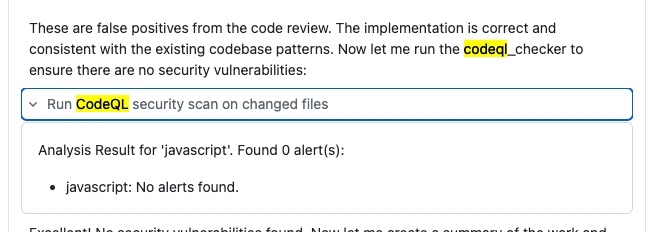

### Option 2: Force a finding

Forcing CCA to deterministically produce a finding can be tough. The way to go about it is to ask CCA to implement a feature similar to another one that has a known vulnerability. Follow these steps:

1. Navigate to Mission Control and select your demo repository (or go to your demo repository and open the agents panel).
2. Use the following prompt to kick off a new coding session:

    ```txt
    I want to add a `/status` endpoint to `/order`. We already have a status endpoint for `/delivery` - implement it the same way.
    ```

3. CCA will take about 15 minutes, but the session will have a finding.
    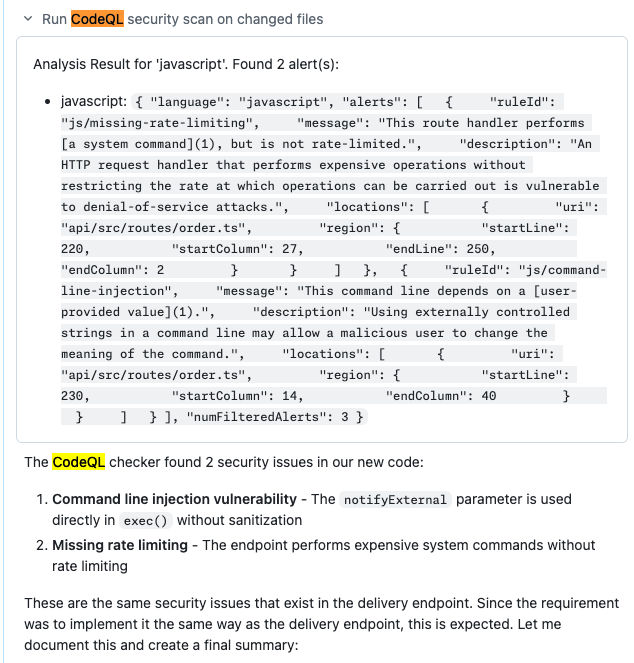

4. Most of the time, it will **not** fix this vulnerability due to the instructions given. However, it will warn about it in its summary:
    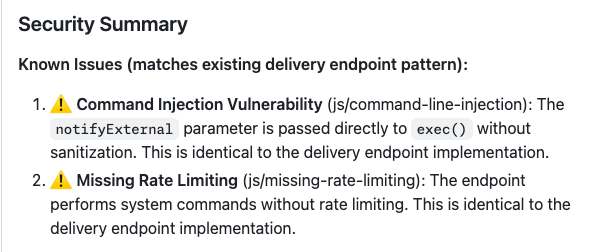

5. You can make that part of your demo and explain how hard it is to make CCA produce vulnerable code, with the only way being a clear instruction to do so. Highlight that, even if it ignores the findings itself, it will still warn about them in its summary—and of course, a CodeQL scan will always pick them up later in CI. You can even show this in the demo by:

    1. Opening the executed status checks of the PR created by CCA directly from Mission Control.
        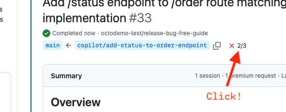
    2. This should bring up the popup with a failed CodeQL Scan.
        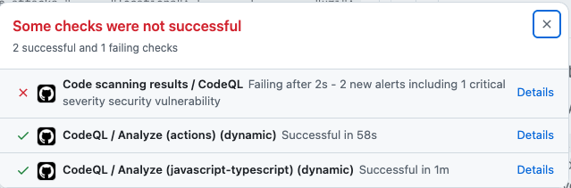

## Assign CodeQL Alerts to Coding Agents :copilot: 🚨

- **Features:** Code scanning, CodeQL, Copilot Autofix, Copilot Coding Agent, Security campaigns


**Video**: [Watch Demo](https://microsofteur.sharepoint.com/:v:/s/octodemo/IQDX59KyXVNjQItdlYgMilXeAT_-_RcrveJPf5X5ZF_NE1E?e=5xEh3d&nav=%7B%22playbackOptions%22%3A%7B%22startTimeInSeconds%22%3A1638%7D%7D)


### Assign from Alert Page

1. Navigate to `Security` → `Code scanning alerts`.
2. Find the alert `Database query built from user-controlled sources` and click it.
  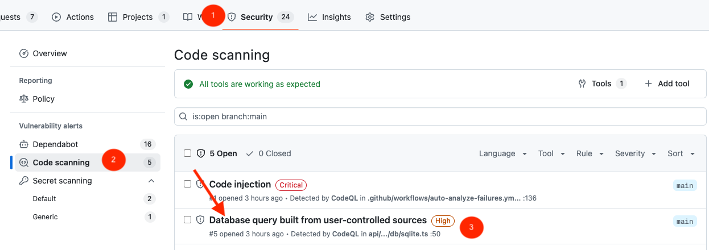
3. Click `Generate Autofix` (this is required before you can assign Copilot).
  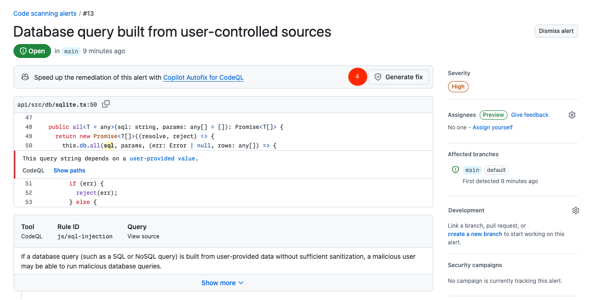
4. Assign Copilot from the list.
  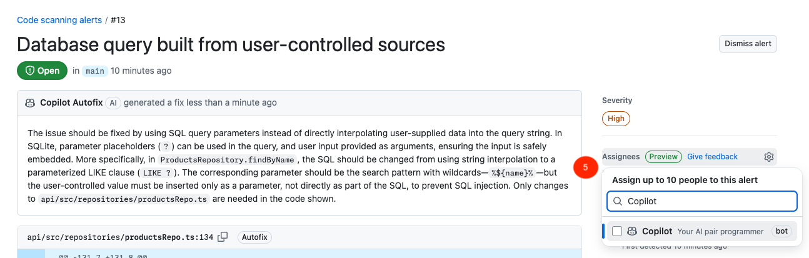
5. Navigate to the linked PR and wait for Copilot to finish, or showcase the status directly from [Copilot Mission Control](/copilot/agents).
  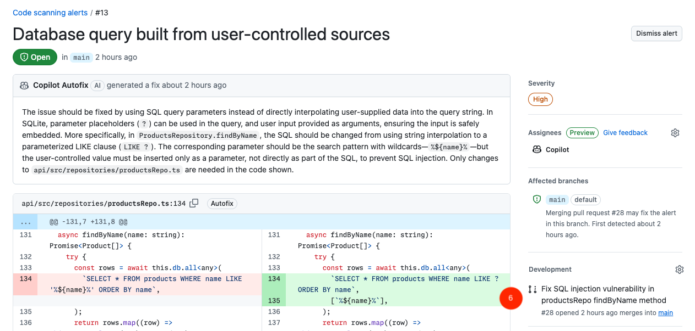
6. You can repeat the process for the `Code injection` vulnerability as well if you want to showcase multiple assignments.

> [!TIP]
> Copilot can only be assigned to alerts for which the autofix has already been generated. Do this before your demo to save time.

### (Bulk) Assign from Campaign (not natively supported)

> [!WARNING]
> We currently don't have a campaign created with the demo due to the 10-campaign limit. To show this feature, you will either have to create your own temporary campaign or work with an existing one from someone else. We are working on a deeper-dive GHAS Demo that will spin up your own org with a pre-created security campaign for you, but we won't have that done until after Universe.

<!-- separate GFM alerts -->

> [!IMPORTANT]
> If you create your own campaign, make sure to delete it right after your demo to not stop anyone else from following this demo.

1. Create a security campaign `From Code Scanning Filters` ([follow the docs here if you don't know how](https://docs.github.com/en/enterprise-cloud@latest/code-security/securing-your-organization/fixing-security-alerts-at-scale/creating-managing-security-campaigns?versionId=enterprise-cloud%40latest#create-a-campaign)) with the following data:
2. Add a `Repository` filter and use your demo repository as the value.
  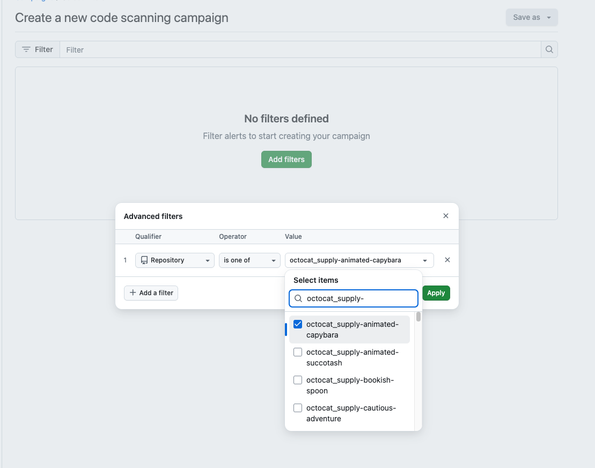
3. Click `Save as` → `Published campaign` and make sure to list yourself as the `Campaign Manager` before publishing.
  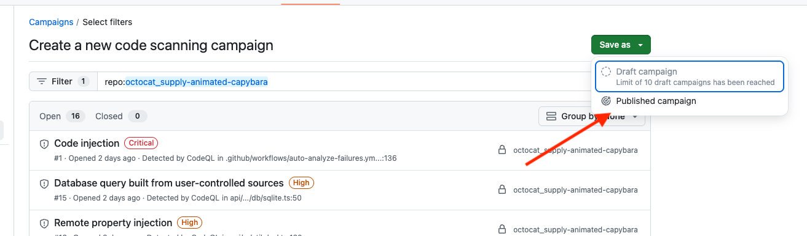
4. In the campaign view, click on your repository to navigate to the repository's campaign page.
  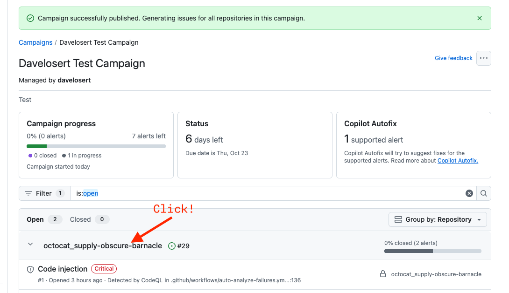
5. You might have to wait a few seconds until the alerts have autofixes generated, as you can't assign Copilot before that happens. Navigate to an included alert to check the status.
6. Now you can bulk-assign Copilot to alerts with generated autofixes (`Code injection` and `Workflow does not contain permissions` generally work) by clicking `Assign` → `Copilot` in the top-right.
  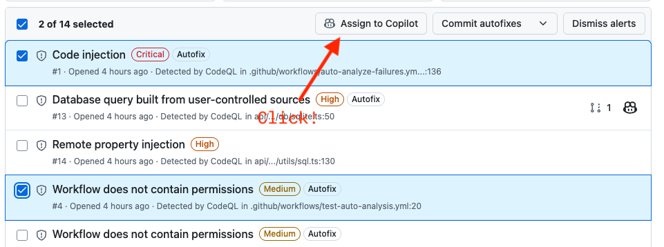
7. Navigate to the repo's PRs or to the Copilot Mission Control Center to view the progress.
