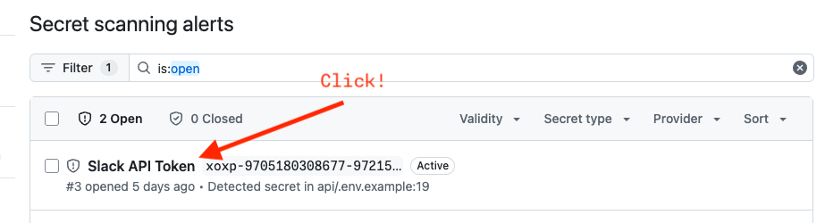
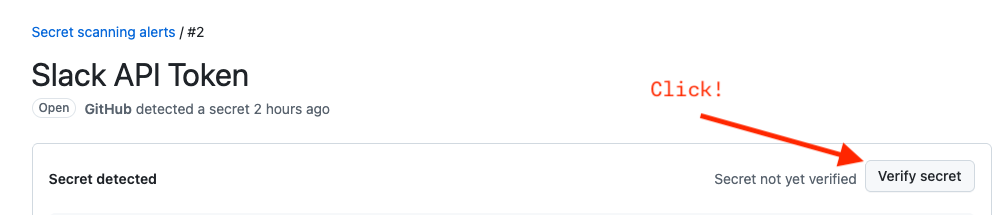
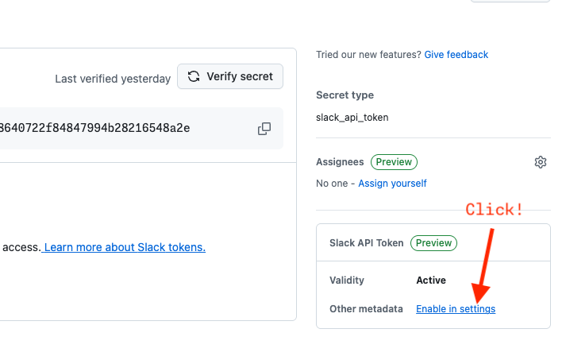
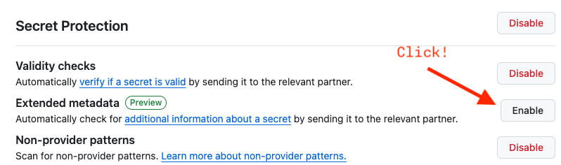
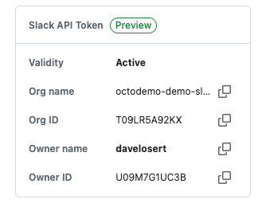

# Secret Scanning

## Main Branch: Leaked Secrets

- **Features:** Secret Scanning

1. Go to the Repository -> Security -> Secrets
2. You will see at least two alerts: one default and one or two generic alerts (the AI-detected alert can take a while to show up)
    1. **Default: GitHub PAT** - This got leaked within the `api/.env.example` file - however, another commit removed the secret again. You can showcase how Secret Scanning goes through the entire GitHub history
    2. **Generic: AI Detected Password** - Also leaked in the `api/.env.example` and removed in another commit, this is so called `generic secret` detected by AI. It's supposed to be a project specific password, so you can demo how GitHub is also capable of detecting these.
    3. **Generic: RSA Token** - Leaked in `api/ca.key`, this is a so called `non-provider` pattern secret

## Push Protection: Anthropic API Key

- **Features:** Push protection

1. Apply the Patch Set `GHAS: Inject Secrets`[^1]
2. This will create a file `logs/debug.log` where you can find a leaked `anthropic` API key.
3. Commit the File
4. Open a terminal and enter `git push`
5. Observe push protection
6. (optional) Navigate to the bypass website contained in the push protection message and demo bypassing push-protection

## GitHub MCP Secret Scanning

- **Features:** GitHub MCP secret scanning, Copilot CLI

1. Apply the Patch Set `GHAS: Inject Secrets`[^1]
2. This will create a file `logs/debug.log` where you can find a leaked `anthropic` API key.
3. **Pre-commit scan via IDE** — With the [GitHub MCP Server](../copilot/mcp.md) started, open Copilot Chat in Agent mode and prompt: `Scan all current changes for exposed secrets and show me the files and lines I should update before I commit`. Copilot will invoke MCP secret scanning, returning the file, line number, and secret type for the leaked key.
4. **Pre-commit scan via CLI** — Open Copilot CLI in the terminal and prompt: `Use the secret scanning tool to check all changed files for any leaked secrets or credentials`. The CLI will surface the same findings through the MCP server. Note that the default MCP tools configuration does not include secret scanning. Start the CLI with `copilot --add-github-mcp-tool run_secret_scanning` or `copilot --enable-all-github-mcp-tools` for this demo.

---------

[^1]: To learn how to apply a patch-set, see [patch-sets.md](../../general/patch-sets.md)

## Secret Scanning with Additional Metadata 🔒 🤫

- **Features:** Secret Scanning

> [!WARNING]
> This feature does not have an API yet and requires manual setup in the repository. You can make this part of the demo or activate it beforehand. To activate it before, navigate to the `Settings` tab of your demo repository, go to the `Advanced Security` tab, scroll to the `Secret scanning extended metadata` section, and enable it.

1. Navigate to the `Security` tab of your demo repository.
2. Click `Secret scanning -> Default`. You should see a leaked `Slack API Token`. Click it.
    
3. Explain how just knowing the secret is sometimes not enough to judge its criticality or to immediately know how to rotate/revoke it due to missing metadata.
4. On the top right, click `Verify Secret`.
    
5. After the verification, you should see a `Slack API Token (Preview)` with an `Other metadata: Enable in settings` link on the right-hand side. Click it.

    

6. Scroll to the `Secret scanning` section and enable `Extended metadata`.

    

7. Navigate back to the secret alert from step 2. You should now see additional metadata about the leaked secret, its validity, `Org name`, and `Owner name`.

    
